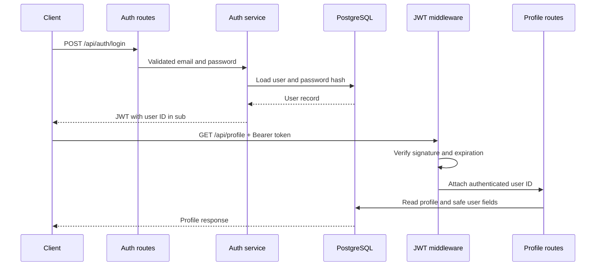

# Authentication and User Profiles

## Overview

The backend provides stateless JWT authentication and an authenticated user-profile API. Passwords are hashed with bcrypt and never returned by the API. Access tokens are signed with the private `JWT_SECRET` environment variable and are not stored in the database.

## Registration flow

`POST /api/auth/register` accepts an email and password. The backend trims and lowercases the email, validates its format, requires a password between 8 and 128 characters, rejects an existing email, hashes the password, and creates the user.

Example request:

```json
{
  "email": "person@example.com",
  "password": "a-strong-password"
}
```

Successful response (`201 Created`):

```json
{
  "success": true,
  "data": {
    "user": {
      "id": "user-uuid",
      "email": "person@example.com",
      "createdAt": "2026-09-23T00:00:00.000Z",
      "updatedAt": "2026-09-23T00:00:00.000Z"
    }
  }
}
```

## Login and JWT flow

`POST /api/auth/login` validates normalized credentials and compares the supplied password with its bcrypt hash. Invalid emails and passwords share the generic `Invalid email or password` response. A successful login returns a JWT access token whose subject (`sub`) is the user's ID.

```json
{
  "success": true,
  "data": {
    "accessToken": "<jwt>",
    "user": {
      "id": "user-uuid",
      "email": "person@example.com"
    }
  }
}
```

The signing key comes from `JWT_SECRET`. Token lifetime comes from `JWT_EXPIRES_IN` and defaults to `7d`.

## Protected route flow

Clients send the token as `Authorization: Bearer <token>`. Authentication middleware verifies the signature and expiration, reads the user ID from `sub`, and attaches it to the request. Missing, invalid, or expired tokens return HTTP 401. Only profile routes currently use this middleware.



## Profile endpoints

### `GET /api/profile`

Returns the authenticated user's safe account fields and profile. The profile is `null` until it is created. `passwordHash` is never selected or returned.

### `PUT /api/profile`

Creates the profile if it does not exist or updates the existing profile. Accepted fields are:

- `age`
- `gender`: `male`, `female`, `non-binary`, `other`, or `prefer-not-to-say`
- `height`
- `weight`
- `activityLevel`: `sedentary`, `lightly-active`, `moderately-active`, `very-active`, or `extra-active`
- `fitnessGoal`
- `dietPreference`
- `allergies`
- `dietaryRestrictions`

Unknown properties, including `userId` and `email`, are rejected. Numeric measurements must be positive and arrays contain trimmed, non-empty strings.

Example request:

```json
{
  "age": 30,
  "height": 175.5,
  "weight": 70.25,
  "activityLevel": "moderately-active",
  "allergies": ["peanuts"],
  "dietaryRestrictions": ["gluten-free"]
}
```

## Security considerations

- Passwords are hashed with bcrypt using 12 rounds and are never logged or returned.
- Login failures use a generic response to avoid revealing whether an email exists.
- JWT secrets come only from environment configuration and must be different for each deployment.
- JWTs are stateless, are not persisted, and currently have no refresh-token flow.
- Protected routes explicitly opt into authentication middleware.
- Unexpected errors return a generic JSON message rather than internal details or stack traces.
- `.env` remains private; `.env.example` contains only empty or non-secret placeholders.

