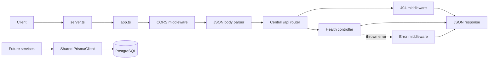

# Backend Architecture

## Purpose

The backend foundation separates HTTP application configuration, server startup, routing, middleware, controllers, services, shared types, utilities, and database access. It currently exposes only the health endpoint; feature APIs and business logic are intentionally deferred.

## Folder structure

```text
backend/src/
├── config/       # Typed environment and shared Prisma client
├── controllers/  # HTTP request handlers
├── middleware/   # Cross-cutting request, 404, and error handling
├── routes/       # Central API router and feature routers
├── services/     # Future application and data-access logic
├── types/        # Shared TypeScript response types
├── utils/        # Small reusable HTTP helpers
├── app.ts        # Express application composition
└── server.ts     # HTTP listener startup
```

## Request flow

Requests enter the Express application through CORS and JSON parsing middleware. Requests under `/api` are forwarded to the central API router, which currently mounts only `/health`. A request that matches no route reaches the JSON 404 handler. Errors passed or thrown during request processing reach the final centralized error handler.



## Environment configuration

`config/env.ts` loads the existing dotenv configuration and validates it during startup. `DATABASE_URL` is required. `PORT` must be a valid TCP port and defaults to `5000` when omitted. `CORS_ORIGIN` may contain a comma-separated allowlist; development defaults to `http://localhost:5173`.

No environment values or credentials are committed to the repository.

## Prisma client architecture

`config/prisma.ts` owns one reusable `PrismaClient`, configured with Prisma's PostgreSQL driver adapter and the validated `DATABASE_URL`. Future services should import this instance instead of constructing their own clients. During development, it is cached on `globalThis` to prevent watch-mode reloads from opening duplicate client instances.

The Prisma schema and migrations remain the source of truth for database structure and are unchanged by this architecture work.

## Middleware and error handling

Middleware runs in this order:

1. CORS policy.
2. JSON body parsing with a `1mb` limit.
3. Central `/api` router.
4. Unknown-route handler returning HTTP 404.
5. Central error handler.

Errors use a consistent JSON shape:

```json
{
  "success": false,
  "message": "Something went wrong"
}
```

Unexpected errors return HTTP 500. Production responses do not expose stack traces or unexpected internal error messages. Errors carrying a valid HTTP error status, such as malformed JSON from Express, retain that status.

## API route organization

The central router is mounted at `/api`. The health router is mounted at `/health`, producing `GET /api/health`. Future feature routers can be mounted alongside it without changing application startup. No placeholder feature endpoints are registered.
