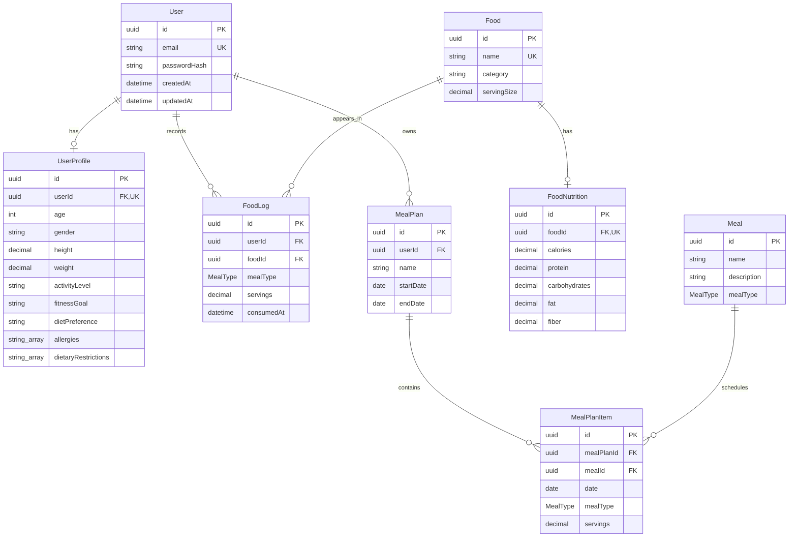

# Database Foundation

## Purpose

The PostgreSQL database stores the core entities and relationships needed by the AI Food Nutrition and Personalized Meal Planning Platform. This layer establishes data structure only; it does not implement authentication, nutrition calculations, recommendations, or application workflows.

Prisma provides the schema, migrations, and generated TypeScript client used to access PostgreSQL.

## Models

- **User** — account identity fields and ownership root for a profile, food logs, and meal plans.
- **UserProfile** — optional one-to-one demographic, body measurement, activity, goal, dietary preference, allergy, and restriction details for a user.
- **Food** — uniquely named food reference with its category and standard serving size.
- **FoodNutrition** — one-to-one nutrient values for a food's standard serving.
- **FoodLog** — records a quantity of food consumed by a user at a specific time and meal type.
- **Meal** — reusable meal definition with an optional description and meal type.
- **MealPlan** — named, dated plan owned by a user.
- **MealPlanItem** — schedules a meal and serving quantity on a date within a meal plan.

## Relationship overview

- A `User` has zero or one `UserProfile`, many `FoodLog` records, and many `MealPlan` records.
- A `Food` has zero or one `FoodNutrition` record and many `FoodLog` records.
- Each `FoodLog` belongs to one user and one food.
- A `MealPlan` belongs to one user and contains many `MealPlanItem` records.
- A `Meal` can appear in many `MealPlanItem` records.
- Owned profile, nutrition, log, plan, and plan-item records cascade when their parent is deleted. Referenced foods and meals are restricted from deletion while logs or plan items still use them.

## Entity relationship diagram

