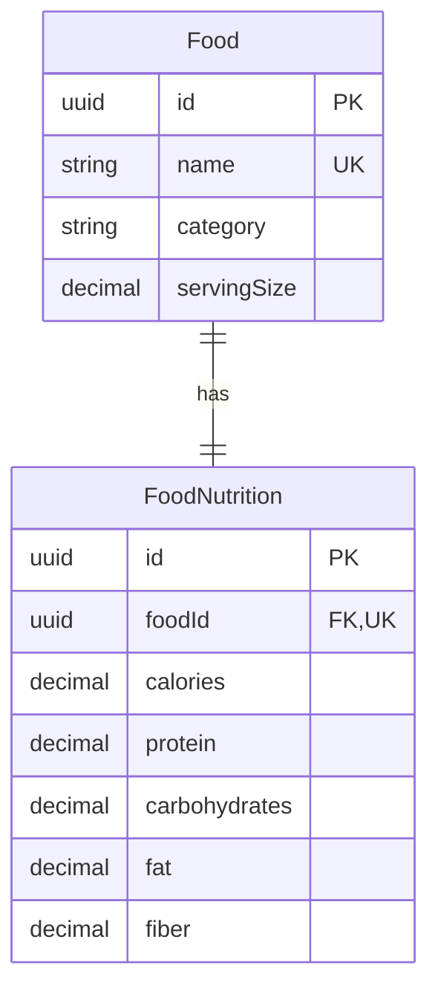

# Food and Nutrition Database

## Purpose and relationship

The food database provides publicly readable reference nutrition data for common foods. `Food` stores identity, category, and serving size. `FoodNutrition` stores the nutrient values for exactly one food through its unique `foodId` foreign key.



The API flattens the one-to-one relationship so clients receive food identity and nutrient fields in one object.

## API endpoints

All food endpoints are public and read-only.

- `GET /api/foods?page=1&limit=20` lists foods.
- `GET /api/foods/search?q=chicken&page=1&limit=20` searches food names.
- `GET /api/foods/:id` returns one food and its nutrition information.

Responses use the standard `{ "success": true, "data": ... }` structure. Pagination data includes `items`, `page`, `limit`, `total`, and `totalPages`. Pages begin at 1, the default limit is 20, and the maximum limit is 100.

## Search behavior

Search performs a trimmed, case-insensitive substring match on `Food.name`. Empty searches are rejected. Results are ordered by name and then ID for stable pagination. No fuzzy, semantic, or AI search is performed.

## Seed process

Run the deterministic seed from `backend/`:

```bash
npm run db:seed
```

The script validates every entry before database access and upserts by the unique food name. Its nested nutrition upsert guarantees one nutrition record per food. Repeated runs update the same records and do not create duplicates.

## Dataset and serving convention

The initial dataset contains 36 foods spanning Indian dishes, vegetarian and non-vegetarian proteins, grains, fruit, vegetables, dairy, and nuts.

Every seed record uses a **100 g edible portion**. This provides one consistent comparison basis, including for foods commonly measured by volume or by individual pieces. Names indicate cooked or dry state when that distinction materially affects values.

Calories, protein, carbohydrates, fat, and fiber are non-negative and expressed per the stated serving. Macronutrients and fiber are in grams; calories are kilocalories.

## Limitations

Seed values are realistic approximations for project demonstrations, not medically exact measurements. Actual nutrition varies with cultivar, brand, recipe, cooking method, water content, and portion measurement. The dataset should not be used as a substitute for verified product labels, laboratory analysis, or clinical dietary guidance.

Food creation remains an internal service/seed capability. There is intentionally no unauthenticated write endpoint.

