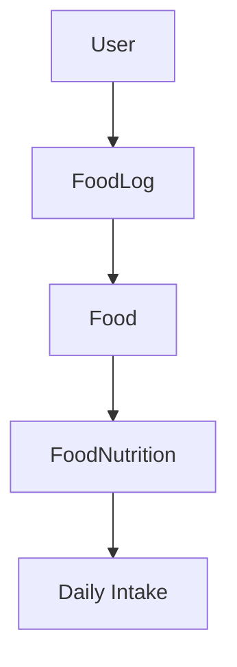
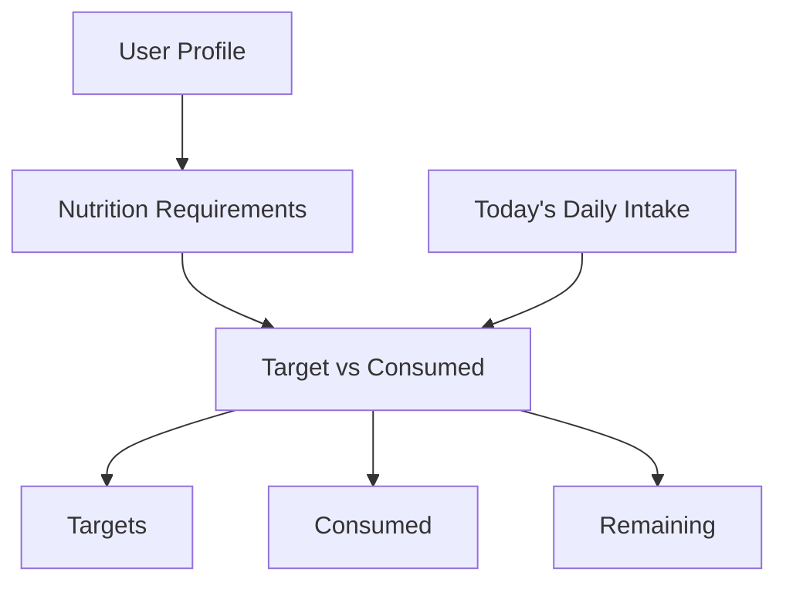

# Food Logging and Daily Intake

## Workflow

Authenticated users create food logs by selecting an existing food, a meal type, a serving quantity, and an optional consumption time. A log stores only the food reference, quantity, meal type, and timestamps. Nutrient totals are derived from the related `FoodNutrition` record when data is read; duplicated calorie or macro values are never stored in `FoodLog`.



## API endpoints

Every endpoint requires `Authorization: Bearer <token>`.

- `POST /api/food-logs` creates a log.
- `GET /api/food-logs` lists the authenticated user's logs.
- `GET /api/food-logs/:id` returns one owned log.
- `PUT /api/food-logs/:id` updates one owned log.
- `DELETE /api/food-logs/:id` deletes one owned log.
- `GET /api/food-logs/summary?date=YYYY-MM-DD` calculates intake for a UTC calendar day.
- `GET /api/food-logs/summary/today` compares today's UTC intake with calculated targets.

### Create example

```json
{
  "foodId": "food-uuid",
  "mealType": "breakfast",
  "quantity": 1.5,
  "consumedAt": "2026-09-23T08:30:00.000Z"
}
```

`consumedAt` defaults to the current server time when omitted. Meal type must be `breakfast`, `lunch`, `dinner`, or `snack`.

### Food-log response

```json
{
  "success": true,
  "data": {
    "id": "log-uuid",
    "foodId": "food-uuid",
    "foodName": "Chicken Breast, Cooked",
    "category": "Protein",
    "servingSize": 100,
    "quantity": 1.5,
    "mealType": "lunch",
    "consumedAt": "2026-09-23T12:30:00.000Z",
    "calories": 247.5,
    "protein": 46.5,
    "carbohydrates": 0,
    "fat": 5.4,
    "fiber": 0
  }
}
```

## Quantity and serving convention

`quantity` is the number of servings, matching the existing database field `FoodLog.servings`. One serving is the food's `servingSize`. The Day 6 seed data uses 100 g servings, so quantity `1.5` represents 150 g for those foods.

Every nutrient is calculated as:

```text
logged nutrient = nutrient per serving × quantity
```

This retains one quantity system and avoids storing derived nutrition values.

## Listing and filters

`GET /api/food-logs` accepts:

- `page` and `limit` for pagination; defaults are 1 and 20, with a maximum limit of 100.
- `date=YYYY-MM-DD` for one UTC calendar day.
- `from=YYYY-MM-DD&to=YYYY-MM-DD` for an inclusive UTC date range.
- `mealType` for one controlled meal type.

Date and range filters can be combined with meal type. A single `date` cannot be combined with `from` or `to`. Results are ordered by `consumedAt` descending and then ID descending.

## Ownership and security

Every database query includes the authenticated user's ID. Reading, updating, or deleting another user's log returns the same HTTP 404 response as a nonexistent log, preventing ownership information disclosure. There are no public food-log routes.

## Daily aggregation

The daily summary multiplies each food's nutrition values by its log quantity and sums calories, protein, carbohydrates, fat, and fiber. Values are rounded to two decimal places.

`foodCount` is the number of log entries for the day. `mealCount` is the number of distinct meal types represented in those entries.

```json
{
  "success": true,
  "data": {
    "date": "2026-09-23",
    "calories": 2100,
    "protein": 120,
    "carbohydrates": 250,
    "fat": 70,
    "fiber": 28,
    "mealCount": 4,
    "foodCount": 5
  }
}
```

## Target versus consumed

The today endpoint reuses the existing nutrition requirements service. It does not duplicate BMR, TDEE, goal, or macro formulas. Remaining values are `target − consumed` and may be negative when consumption exceeds a target.



If the profile is missing or incomplete, the endpoint returns the same HTTP 422 profile-required or validation response as `GET /api/nutrition/requirements`.

