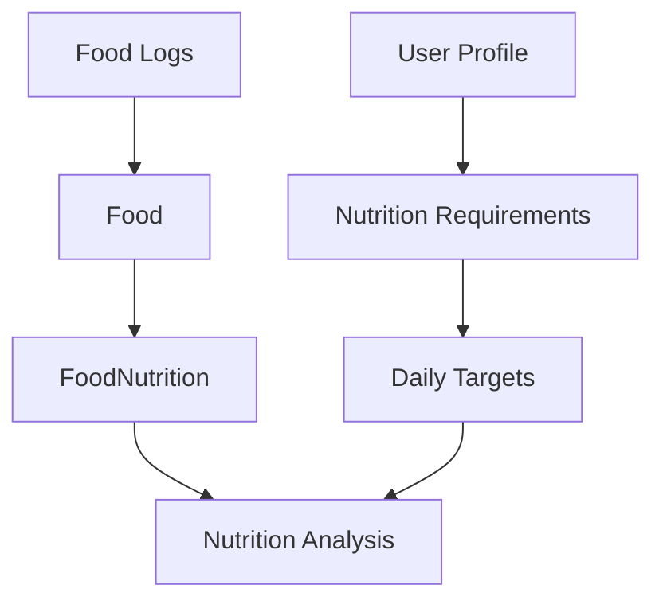
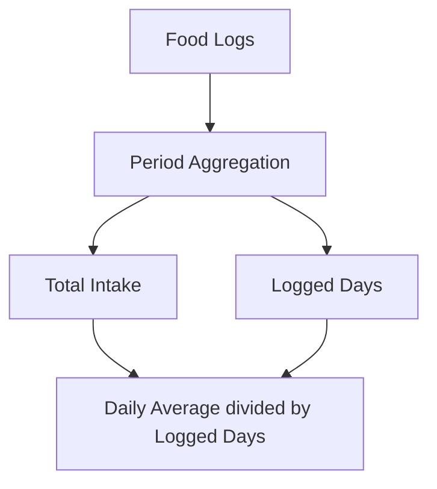

# Nutrition Analysis and Progress

## Overview

The nutrition analysis layer combines an authenticated user's validated profile, calculated daily requirements, food logs, and food nutrition values. It reuses the existing requirements and food-log services, stores no derived analysis records, and does not provide medical recommendations.



## Daily analysis

`GET /api/nutrition/analysis?date=YYYY-MM-DD` is JWT-protected and uses a UTC calendar date.

It returns:

- Daily calorie, protein, carbohydrate, fat, and fiber targets.
- The user's consumed nutrients for that date.
- Remaining amounts calculated as `target − consumed`; these may be negative.
- Whole-number consumption percentages.
- Per-meal nutrition totals for meal types with logged foods.
- The individual food-log nutrition contributions.
- Deterministic calorie and protein progress statuses.

The calorie and macronutrient targets come directly from the existing nutrition requirements service. Since the current profile and requirements models contain no fiber formula, the analysis uses a centralized demonstration target of 30 g/day.

### Percentage calculation

```text
percent consumed = round(consumed ÷ target × 100)
```

A zero target produces zero percent rather than division by zero.

### Example response

```json
{
  "success": true,
  "data": {
    "date": "2026-09-23",
    "targets": {
      "calories": 2759,
      "protein": 128,
      "carbohydrates": 389,
      "fat": 77,
      "fiber": 30
    },
    "consumed": {
      "calories": 250,
      "protein": 25,
      "carbohydrates": 50,
      "fat": 12.5,
      "fiber": 5
    },
    "remaining": {
      "calories": 2509,
      "protein": 103,
      "carbohydrates": 339,
      "fat": 64.5,
      "fiber": 25
    },
    "percentConsumed": {
      "calories": 9,
      "protein": 20,
      "carbohydrates": 13,
      "fat": 16,
      "fiber": 17
    }
  }
}
```

## Meal breakdown

Meal totals use the Day 7 serving-scaled food-log values. Only meal types with logged food are returned, ordered as breakfast, lunch, dinner, and snack.

```json
{
  "mealType": "breakfast",
  "calories": 500,
  "protein": 25,
  "carbohydrates": 60,
  "fat": 15
}
```

## Food breakdown

Each food entry identifies the food, logged quantity, meal type, and its calculated nutrition contribution. Values are computed from `FoodNutrition × quantity`; they are not duplicated in the database.

```json
{
  "foodId": "food-uuid",
  "name": "Chicken Breast, Cooked",
  "quantity": 2,
  "mealType": "lunch",
  "calories": 330,
  "protein": 62,
  "carbohydrates": 0,
  "fat": 7.2
}
```

## Goal progress

Daily analysis includes `goalProgress` using the profile's existing fitness goal. Calories and protein are classified independently:

- `under_target`: below 90% of target
- `near_target`: 90% through 110%, inclusive
- `over_target`: above 110%

These thresholds are deterministic project indicators and are not medically validated recommendations.

## Period analysis

`GET /api/nutrition/analysis/period?from=YYYY-MM-DD&to=YYYY-MM-DD` is JWT-protected. Both dates are inclusive UTC calendar dates.

It returns the calendar-day count, nutrition totals, the number of dates with actual logs, and averages divided by logged days—not total calendar days. When no days contain logs, totals and averages are zero.



## Date and range rules

- Dates must be real calendar dates formatted `YYYY-MM-DD`.
- `from` must be on or before `to`.
- Both endpoints interpret dates in UTC.
- Periods include both endpoints and may span at most 31 calendar days.
- Every query is scoped to the authenticated user's ID.
- A missing or incomplete profile produces the same HTTP 422 response as the requirements endpoint.

## Limitations

- Analysis accuracy depends on the underlying approximate food data and logged quantities.
- The serving convention remains one `Food.servingSize` per quantity unit.
- Fiber uses a fixed demonstration target because no personalized fiber model exists yet.
- Goal statuses do not account for longer-term trends or individual medical needs.
- No analysis values, progress states, or summaries are persisted.

