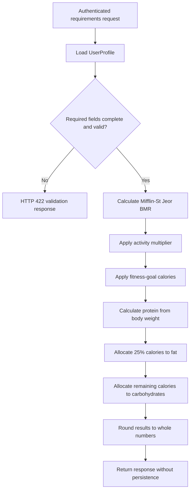

# Nutrition Calculation Engine

## Purpose

The nutrition engine provides deterministic daily energy and macronutrient estimates from an authenticated user's completed profile. Results are calculated on request and are not stored in the database.

These values are general project estimates, not medical advice or medically personalized prescriptions. Individual needs can differ because of health conditions, body composition, pregnancy, medications, and other factors that this foundation does not model.

## Required profile data

The calculation requires:

- Age from 13 to 120 years
- Gender value `male` or `female`, as required by the selected equation
- Height from 80 to 250 centimeters
- Weight from 20 to 500 kilograms
- A supported activity level
- A supported fitness goal

Missing, unsupported, zero, negative, or unrealistic values produce HTTP 422 instead of a partial calculation.

## Basal metabolic rate

The engine uses the Mifflin-St Jeor equation.

For male profiles:

```text
BMR = 10 × weight(kg) + 6.25 × height(cm) − 5 × age + 5
```

For female profiles:

```text
BMR = 10 × weight(kg) + 6.25 × height(cm) − 5 × age − 161
```

## Activity and TDEE

Total daily energy expenditure is `BMR × activity multiplier`.

| Activity level | Multiplier |
| --- | ---: |
| `sedentary` | 1.2 |
| `light` | 1.375 |
| `moderate` | 1.55 |
| `very_active` | 1.725 |
| `extra_active` | 1.9 |

Legacy profile values created by the existing API, such as `lightly-active` and `moderately-active`, are normalized to their equivalent internal levels.

## Fitness-goal adjustments

| Fitness goal | Adjustment |
| --- | ---: |
| `weight_loss` | −500 kcal |
| `weight_gain` | +300 kcal |
| `muscle_gain` | +300 kcal |
| `maintenance` | 0 kcal |

Daily target calories equal TDEE plus the goal adjustment.

## Macronutrient calculation

Protein is based on body weight:

- Maintenance: 1.6 g/kg
- Weight loss: 1.8 g/kg
- Weight gain or muscle gain: 2.0 g/kg

Fat receives 25% of daily target calories. Carbohydrates receive the calories remaining after protein and fat; the result is clamped to zero so it cannot be negative.

Energy conversion factors are:

- Protein: 4 kcal/g
- Carbohydrates: 4 kcal/g
- Fat: 9 kcal/g

All returned values are rounded to the nearest whole number.

## API endpoint

`GET /api/nutrition/requirements` requires an `Authorization: Bearer <token>` header.

Example response:

```json
{
  "success": true,
  "data": {
    "bmr": 1780,
    "tdee": 2759,
    "dailyCalories": 2759,
    "protein": 128,
    "carbohydrates": 389,
    "fat": 77
  }
}
```

## Calculation flow



## Limitations and assumptions

- The Mifflin-St Jeor equation uses binary sex-specific constants; profiles outside `male` and `female` cannot be calculated by this implementation.
- Height is assumed to be centimeters and weight kilograms.
- Activity level and fitness goal are self-reported.
- Fixed goal adjustments and macro ratios are broad estimates.
- The engine does not account for medical history, body-fat percentage, pregnancy, or sport-specific needs.

